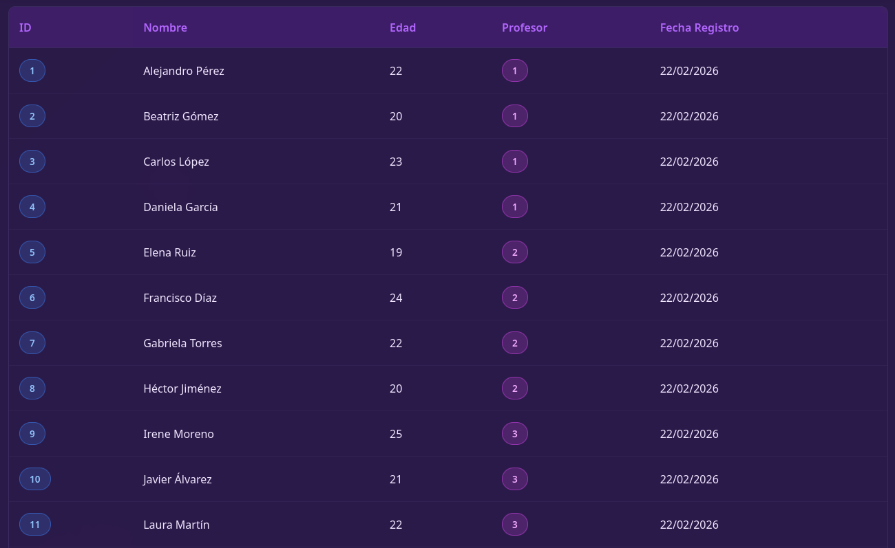
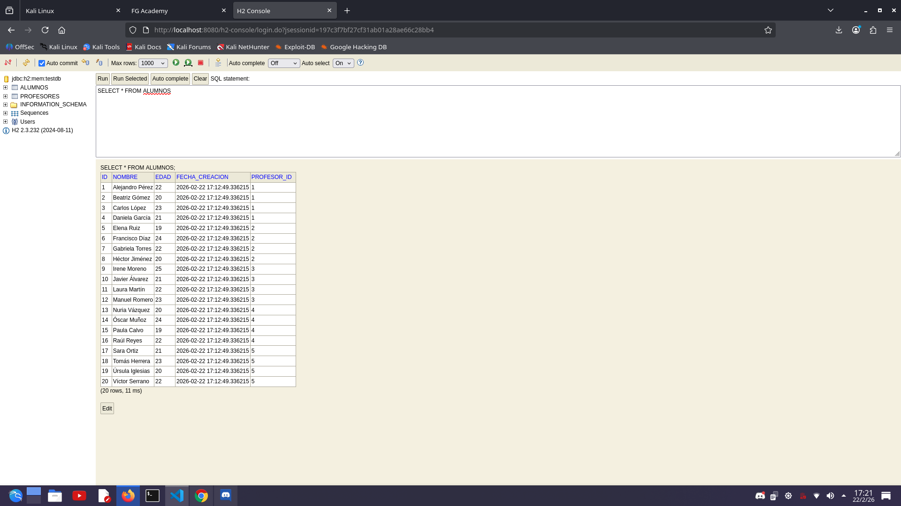

# 5. Capturas de la ejecución de la funcionalidad

[← Anterior: Implementación](4_Implementacion.md) | [Volver al índice](../READMEx.md) | [Siguiente: Información Herramientas →](6_Herramientas.md)

---

## 5.1 Ejecución de las pruebas

### 5.1.1 Pruebas de API

### 5.1.2 Consola H2

---

[← Anterior: Implementación](4_Implementacion.md) | [Volver al índice](../README.md) | [Siguiente: Información Herramientas →](6_Herramientas.md)